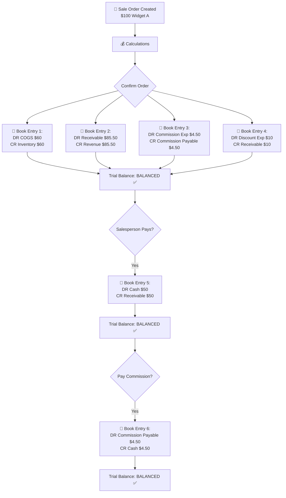

# Salesperson Sales Accounting Fix - README

## 📋 Overview

This document explains the accounting fixes made to ensure all salesperson sales transactions are properly balanced in the chart of accounts and trial balance, following correct accounting standards.

---

## 🔧 Changes Made

### Files Modified

1. **`idil/models/sales.py`**
   - Added CR Receivable entry to balance DR Discount Expense
   - Added CR Receivable entry to balance DR Commission Expense (daily schedule)

2. **`idil/models/sales_commission.py`**
   - Added full journal entry when paying commission (DR Commission Payable, CR Cash/Bank)

3. **`idil/data/transaction_source_data.xml`**
   - Added "Commission Payment" transaction source

---

## 💰 Real Transaction Example

### Scenario: Product Sale with Commission and Discount

**Product Details:**
- Product: "Widget A"
- Sale Price: **$100.00**
- Cost Price: **$60.00**
- Commission Rate: **5%**
- Discount Rate: **10%** (Quantity discount)
- Quantity Sold: **1 unit**

**Salesperson Details:**
- Name: "John Doe"
- Commission Schedule: **Monthly**

**Calculations:**
```
Sale Price:            $100.00
Discount (10%):        -$10.00
----------------------------
Net Sale:               $90.00

Commission Base:        $90.00
Commission (5%):        $4.50
----------------------------
Salesperson Owes:       $85.50
```

---

## 📊 Accounting Entries - Sale Confirmation

### Journal Entry #1: Sale Order Confirmation

| # | Date | Account | Account Type | Description | Debit ($) | Credit ($) |
|---|------|---------|--------------|-------------|-----------|------------|
| 1 | 2025-01-15 | COGS Account | Expense | Cost of Widget A | 60.00 | |
| 2 | 2025-01-15 | Inventory Account | Asset | Reduce inventory - Widget A | | 60.00 |
| 3 | 2025-01-15 | John Doe - Receivable | Asset | Amount owed by salesperson | 85.50 | |
| 4 | 2025-01-15 | Sales Revenue | Revenue | Sale of Widget A | | 85.50 |
| 5 | 2025-01-15 | Commission Expense | Expense | Sales commission - Widget A | 4.50 | |
| 6 | 2025-01-15 | Commission Payable | Liability | Commission owed to John | | 4.50 |
| 7 | 2025-01-15 | Discount Expense | Expense | Sales discount - Widget A | 10.00 | |
| 8 | 2025-01-15 | John Doe - Receivable | Asset | Discount reduces receivable | | 10.00 |
| | | | | **TOTALS** | **160.00** | **160.00** |

✅ **Entry is BALANCED** (Total DR = Total CR)

---

## 📈 T-Account Visualization

### After Sale Confirmation:

```
┌─────────────────────────┐  ┌─────────────────────────┐
│  COGS (Expense)         │  │  Inventory (Asset)      │
├─────────────────────────┤  ├─────────────────────────┤
│ DR        60.00 │       │  │        │ CR       60.00 │
│                 │       │  │        │                │
│ Balance   60.00 │       │  │        │ Balance (60.00)│
└─────────────────────────┘  └─────────────────────────┘

┌─────────────────────────────────────┐  ┌─────────────────────────┐
│  Salesperson Receivable (Asset)     │  │  Revenue (Income)       │
├─────────────────────────────────────┤  ├─────────────────────────┤
│ DR        85.50 │ CR       10.00    │  │        │ CR       85.50 │
│                 │                   │  │        │                │
│ Balance   75.50 │                   │  │        │ Balance (85.50)│
└─────────────────────────────────────┘  └─────────────────────────┘
         (Net: what salesperson owes)

┌─────────────────────────┐  ┌─────────────────────────┐
│  Commission Expense     │  │  Commission Payable     │
├─────────────────────────┤  ├─────────────────────────┤
│ DR         4.50 │       │  │        │ CR        4.50 │
│                 │       │  │        │                │
│ Balance    4.50 │       │  │        │ Balance  (4.50)│
└─────────────────────────┘  └─────────────────────────┘

┌─────────────────────────┐
│  Discount Expense       │
├─────────────────────────┤
│ DR        10.00 │       │
│                 │       │
│ Balance   10.00 │       │
└─────────────────────────┘
```

---

## 💵 Accounting Entries - Receipt Payment

### Journal Entry #2: Salesperson Pays $50

| # | Date | Account | Account Type | Description | Debit ($) | Credit ($) |
|---|------|---------|--------------|-------------|-----------|------------|
| 1 | 2025-01-20 | Cash Account | Asset | Payment received from John | 50.00 | |
| 2 | 2025-01-20 | John Doe - Receivable | Asset | Reduce receivable | | 50.00 |
| | | | | **TOTALS** | **50.00** | **50.00** |

✅ **Entry is BALANCED**

### Updated T-Account:

```
┌─────────────────────────────────────┐
│  Salesperson Receivable (Asset)     │
├─────────────────────────────────────┤
│ DR        85.50 │ CR       10.00    │
│                 │          50.00    │
│                 │                   │
│ Balance   25.50 │                   │
└─────────────────────────────────────┘
     (Remaining owed: $25.50)

┌─────────────────────────┐
│  Cash (Asset)           │
├─────────────────────────┤
│ DR        50.00 │       │
│                 │       │
│ Balance   50.00 │       │
└─────────────────────────┘
```

---

## 🎯 Accounting Entries - Commission Payment

### Journal Entry #3: Pay Commission to Salesperson

| # | Date | Account | Account Type | Description | Debit ($) | Credit ($) |
|---|------|---------|--------------|-------------|-----------|------------|
| 1 | 2025-02-01 | Commission Payable | Liability | Clear commission liability | 4.50 | |
| 2 | 2025-02-01 | Cash Account | Asset | Cash paid to John | | 4.50 |
| | | | | **TOTALS** | **4.50** | **4.50** |

✅ **Entry is BALANCED**

### Updated T-Account:

```
┌─────────────────────────┐  ┌─────────────────────────┐
│  Commission Payable     │  │  Cash (Asset)           │
├─────────────────────────┤  ├─────────────────────────┤
│ DR         4.50 │CR 4.50│  │ DR 50.00 │ CR    4.50  │
│                 │       │  │          │             │
│ Balance    0.00 │       │  │          │ Balance45.50│
└─────────────────────────┘  └─────────────────────────┘
     (Liability cleared)            (Cash reduced)
```

---

## 📊 Trial Balance Impact

### Before Any Transactions

| Account | Account Type | Debit | Credit |
|---------|--------------|-------|--------|
| Cash | Asset | 1,000.00 | |
| Inventory | Asset | 500.00 | |
| **TOTALS** | | **1,500.00** | **1,500.00** |

### After Sale Confirmation

| Account | Account Type | Debit | Credit |
|---------|--------------|-------|--------|
| Cash | Asset | 1,000.00 | |
| Inventory | Asset | 440.00 | |
| Salesperson Receivable | Asset | 75.50 | |
| Commission Payable | Liability | | 4.50 |
| Revenue | Income | | 85.50 |
| COGS | Expense | 60.00 | |
| Commission Expense | Expense | 4.50 | |
| Discount Expense | Expense | 10.00 | |
| **TOTALS** | | **1,590.00** | **1,590.00** |

✅ **Trial Balance is BALANCED**

### After Receipt Payment ($50)

| Account | Account Type | Debit | Credit |
|---------|--------------|-------|--------|
| Cash | Asset | 1,050.00 | |
| Inventory | Asset | 440.00 | |
| Salesperson Receivable | Asset | 25.50 | |
| Commission Payable | Liability | | 4.50 |
| Revenue | Income | | 85.50 |
| COGS | Expense | 60.00 | |
| Commission Expense | Expense | 4.50 | |
| Discount Expense | Expense | 10.00 | |
| **TOTALS** | | **1,590.00** | **1,590.00** |

✅ **Trial Balance is BALANCED**

### After Commission Payment ($4.50)

| Account | Account Type | Debit | Credit |
|---------|--------------|-------|--------|
| Cash | Asset | 1,045.50 | |
| Inventory | Asset | 440.00 | |
| Salesperson Receivable | Asset | 25.50 | |
| Commission Payable | Liability | | 0.00 |
| Revenue | Income | | 85.50 |
| COGS | Expense | 60.00 | |
| Commission Expense | Expense | 4.50 | |
| Discount Expense | Expense | 10.00 | |
| **TOTALS** | | **1,585.50** | **1,585.50** |

✅ **Trial Balance is BALANCED**

---

## 🔄 Complete Transaction Flow Diagram



---

## 🆚 Before vs After Fix

### BEFORE Fix (❌ Unbalanced)

**Sale Confirmation Entry:**
| Account | Debit | Credit |
|---------|-------|--------|
| COGS | 60.00 | |
| Inventory | | 60.00 |
| Receivable | 85.50 | |
| Revenue | | 85.50 |
| Commission Expense | 4.50 | |
| ❌ **Missing CR** | | **?** |
| Discount Expense | 10.00 | |
| ❌ **Missing CR** | | **?** |
| **TOTALS** | **160.00** | **145.50** |

❌ **IMBALANCED by $14.50**

### AFTER Fix (✅ Balanced)

**Sale Confirmation Entry:**
| Account | Debit | Credit |
|---------|-------|--------|
| COGS | 60.00 | |
| Inventory | | 60.00 |
| Receivable | 85.50 | |
| Revenue | | 85.50 |
| Commission Expense | 4.50 | |
| ✅ **Commission Payable** | | **4.50** |
| Discount Expense | 10.00 | |
| ✅ **Receivable** | | **10.00** |
| **TOTALS** | **160.00** | **160.00** |

✅ **BALANCED**

---

## 🧪 Testing Instructions

### 1. Upgrade Module

```bash
# In Odoo, go to:
Settings → Apps → Search "idil" → Upgrade
```

### 2. Create Test Sale Order

1. Go to **Sales → Salesperson Sales**
2. Create new sale order
3. Select salesperson with **Monthly commission schedule**
4. Add product with:
   - Commission enabled (5%)
   - Discount enabled (10%)
   - Price: $100
5. **Confirm** the order

### 3. Verify Accounting Entries

1. Go to **Accounting → Transaction Bookings**
2. Find the booking for your sale order
3. Check **Booking Lines**:
   - Count total lines (should be 8)
   - Verify **Total DR = Total CR**

### 4. Check Trial Balance

1. Go to **Accounting → Reports → Trial Balance**
2. Verify **Total Debit = Total Credit**

---

## 📌 Key Points

### What Was Fixed?

1. **Discount Expense** now has matching **CR Receivable**
2. **Commission Expense** (daily schedule) now has matching **CR Receivable**
3. **Commission Expense** (monthly schedule) now has matching **CR Commission Payable**
4. **Commission Payment** now creates proper journal entry (DR Payable, CR Cash)

### Why It Matters?

- ✅ All journal entries are balanced (DR = CR)
- ✅ Trial balance is accurate
- ✅ Financial reports are correct
- ✅ Follows standard accounting principles

### Daily vs Monthly Commission

| Schedule | Commission Accounting |
|----------|----------------------|
| **Daily** | DR Commission Expense<br/>CR Receivable *(immediate offset)* |
| **Monthly** | DR Commission Expense<br/>CR Commission Payable *(deferred)* |

---

## ⚠️ Important Note

**Existing Data:** Sales orders confirmed before this fix will still have unbalanced entries. If you need to fix historical data, contact your system administrator for a data migration script.

---

## 📞 Support

For questions or issues with this accounting fix, please contact your development team.

**Last Updated:** 2025-12-07  
**Version:** 1.0
